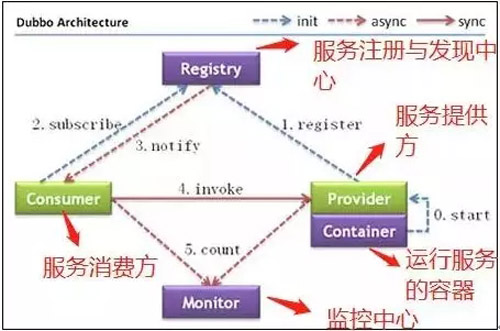

#ZooKeeper概念

[](https://github.com/zmczmckkk/Distributed-System-Study/pulls)
[](https://github.com/zmczmckkk/Distributed-System-Study)
[](https://github.com/zmczmckkk/Distributed-System-Study)
          
　　搬运来源:
   [这可能是把ZooKeeper概念讲的最清楚的一篇文章](http://developer.51cto.com/art/201809/583184.htm)   
　　本人只做板式调整，如有冒犯，请联系。
  ## 什么是 ZooKeeper
  ### ZooKeeper 的由来  
　　下面这段内容摘自《从 Paxos 到 ZooKeeper 》第四章第一节的某段内容，推荐大家阅读一下:  
> `Zookeeper` 最早起源于雅虎研究院的一个研究小组。在当时，研究人员发现，在雅虎内部很多大型系统基本都需要依赖一个类似的系统来进行`分布式协调`，但是这些系统往往都存在分布式单点问题。  
　　所以，雅虎的开发人员就试图开发一个通用的无单点问题的分布式协调框架，以便让开发人员将精力集中在处理业务逻辑上。  
　　关于`ZooKeeper`这个项目的名字，其实也有一段趣闻。在立项初期，考虑到之前内部很多项目都是使用动物的名字来命名的（例如著名的`Pig`项目)，雅虎的工程师希望给这个项目也取一个动物的名字。  
　　时任研究院的首席科学家 Raghu Ramakrishnan 开玩笑地说：“在这样下去，我们这儿就变成动物园了！”  
　　此话一出，大家纷纷表示就叫动物园管理员吧，因为各个以动物命名的分布式组件放在一起，雅虎的整个分布式系统看上去就像一个大型的动物园了。
  而 `Zookeeper` 正好要用来进行分布式环境的协调，于是，`Zookeeper` 的名字也就由此诞生了。
  ### ZooKeeper 概念
* `ZooKeeper`是一个开源的分布式协调服务，`ZooKeeper`框架最初是在“Yahoo!"上构建的，用于以简单而稳健的方式访问他们的应用程序  
* 后来，`Apache ZooKeeper`成为`Hadoop`，`HBase`和其他分布式框架使用的有组织服务的标准。例如`Apache HBase`使用`ZooKeeper`跟踪分布式数据的状态。
* `ZooKeeper`的设计目标是将那些复杂且容易出错的分布式一致性服务封装起来，构成一个高效可靠的`原语集`，并以一系列简单易用的`接口`提供给用户使用。  
```
        原语：操作系统或计算机网络用语范畴。  
        它是由若干条指令组成的，用于完成一定功能的一个过程。
        具有不可分割性，即原语的执行必须是连续的，在执行过程中不允许被中断。
```      
* `ZooKeeper` 是一个典型的分布式数据一致性解决方案，分布式应用程序可以基于 ZooKeeper 实现诸如数据发布/订阅、负载均衡、命名服务、分布式协调/通知、集群管理、Master 选举、分布式锁和分布式队列等功能。
* `ZooKeeper` 一个最常用的使用场景就是用于担任`服务生产者`和`服务消费者`的`注册中心`。
* `服务生产者`将自己提供的服务注册到 ZooKeeper 中心，`服务的消费者`在进行服务调用的时候先到`ZooKeeper`中查找服务，获取到`服务生产者`的详细信息之后，再去调用`服务生产者`的内容与数据。
　　  
如下图所示，在 Dubbo 架构中 ZooKeeper 就担任了注册中心这一角色。  
  
### 结合个人使用讲一下 ZooKeeper   
　　在我自己做过的项目中，主要使用到了 ZooKeeper 作为 Dubbo 的注册中心(Dubbo 官方推荐使用 ZooKeeper 注册中心)。    
　　另外在搭建 Solr 集群的时候，我使用  ZooKeeper 作为 Solr 集群的管理工具。  
　　这时ZooKeeper 主要提供下面几个功能：

            1. 配置文件的集中管理。  
            2. 集群管理：容错、负载均衡。  
            3. 集群的入口。
　　我个人觉得在使用 ZooKeeper 的时候，最好是使用集群版的 ZooKeeper 而不是单机版的。官网给出的架构图就描述的是一个集群版的 ZooKeeper 。通常 3 台服务器就可以构成一个  `ZooKeeper` 集群了。
为什么最好使用奇数台服务器构成 ZooKeeper 集群？  
　　我们知道在 ZooKeeper 中 Leader 选举算法采用了 Zab 协议。Zab 核心思想是当多数 Server 写成功，则任务数据写成功：  

            1. 如果有 3 个 Server，则最多允许 1 个 Server 挂掉.
            2. 如果有 4 个 Server，则同样最多允许 1 个 Server 挂掉。
　　既然 3 个或者 4 个 Server，同样最多允许 1 个 Server 挂掉，那么它们的可靠性是一样的。
所以选择奇数个 ZooKeeper Server 即可，这里选择 3 个 Server。
## 关于 ZooKeeper  的一些重要概念
### 重要概念总结
* ZooKeeper 本身就是一个分布式程序（只要半数以上节点存活，ZooKeeper 就能正常服务）。
* 为了保证高可用，最好是以集群形态来部署 ZooKeeper，这样只要集群中大部分机器是可用的（能够容忍一定的机器故障），那么 ZooKeeper 本身仍然是可用的。
* ZooKeeper 将数据保存在内存中，这也就保证了 高吞吐量和低延迟（但是内存限制了能够存储的容量不太大，此限制也是保持 Znode 中存储的数据量较小的进一步原因）。
* ZooKeeper 是高性能的。在“读”多于“写”的应用程序中尤其地高性能，因为“写”会导致所有的服务器间同步状态。（“读”多于“写”是协调服务的典型场景。）  
　　ZooKeeper 有临时节点的概念。当创建临时节点的客户端会话一直保持活动，瞬时节点就一直存在。而当会话终结时，瞬时节点被删除。持久节点是指一旦这个 ZNode 被创建了，除非主动进行 ZNode 的移除操作，否则这个 ZNode 将一直保存在 Zookeeper 上。
* ZooKeeper 底层其实只提供了两个功能：①管理（存储、读取）用户程序提交的数据；②为用户程序提交数据节点监听服务。
### 会话（Session）
　　Session 指的是 ZooKeeper  服务器与客户端会话。在 ZooKeeper 中，一个客户端连接是指客户端和服务器之间的一个 TCP 长连接。  

　　客户端启动的时候，首先会与服务器建立一个 TCP 连接，从第一次连接建立开始，客户端会话的生命周期也开始了。  

　　通过这个连接，客户端能够通过心跳检测与服务器保持有效的会话，也能够向 Zookeeper 服务器发送请求并接受响应，同时还能够通过该连接接收来自服务器的 Watch 事件通知。  

　　Session 的 sessionTimeout 值用来设置一个客户端会话的超时时间。  

　　当由于服务器压力太大、网络故障或是客户端主动断开连接等各种原因导致客户端连接断开时，只要在 sessionTimeout 规定的时间内能够重新连接上集群中任意一台服务器，那么之前创建的会话仍然有效。  

　　在为客户端创建会话之前，服务端首先会为每个客户端都分配一个 sessionID。  

　　由于 sessionID 是 Zookeeper 会话的一个重要标识，许多与会话相关的运行机制都是基于这个 sessionID 的。  

　　因此，无论是哪台服务器为客户端分配的 sessionID，都务必保证全局唯一。  
### Znode
　　在谈到分布式的时候，我们通常说的“节点"是指组成集群的每一台机器。然而，在 ZooKeeper 中，“节点"分为两类：  
```
        1. 第一类同样是指构成集群的机器，我们称之为机器节点。
        2. 第二类则是指数据模型中的数据单元，我们称之为数据节点一ZNode。
```        
　　ZooKeeper 将所有数据存储在内存中，数据模型是一棵树（Znode Tree)，由斜杠（/）的进行分割的路径，就是一个 Znode，例如/foo/path1。每个上都会保存自己的数据内容，同时还会保存一系列属性信息。  

　　在 Zookeeper 中，Node 可以分为持久节点和临时节点两类。所谓持久节点是指一旦这个 ZNode 被创建了，除非主动进行 ZNode 的移除操作，否则这个 ZNode 将一直保存在 ZooKeeper 上。  

　　而临时节点就不一样了，它的生命周期和客户端会话绑定，一旦客户端会话失效，那么这个客户端创建的所有临时节点都会被移除。  

　　另外，ZooKeeper 还允许用户为每个节点添加一个特殊的属性：`SEQUENTIAL`。一旦节点被标记上这个属性，那么在这个节点被创建的时候，ZooKeeper 会自动在其节点名后面追加上一个整型数字，这个整型数字是一个由父节点维护的自增数字。