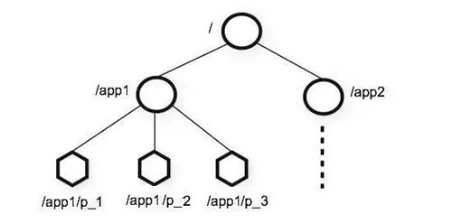
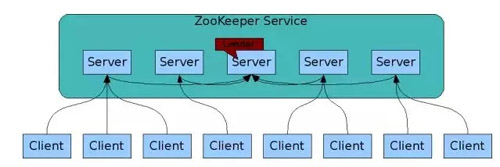
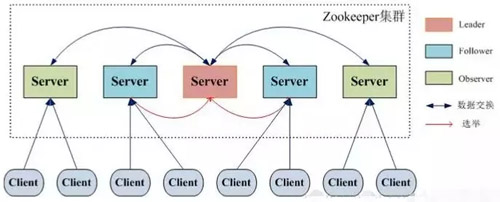
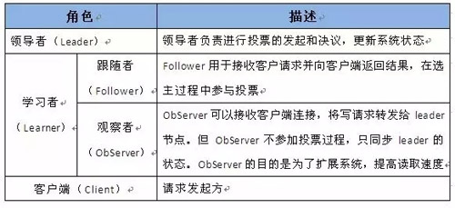

#ZooKeeper概念

[](https://github.com/zmczmckkk/Distributed-System-Study/pulls)
[](https://github.com/zmczmckkk/Distributed-System-Study)
[](https://github.com/zmczmckkk/Distributed-System-Study)
          
　　搬运来源:
   [这可能是把ZooKeeper概念讲的最清楚的一篇文章](http://developer.51cto.com/art/201809/583184.htm)   
　　本人只做板式调整，如有冒犯，请联系。
  ## 什么是 ZooKeeper
  ### ZooKeeper 的由来  
　　下面这段内容摘自《从 Paxos 到 ZooKeeper 》第四章第一节的某段内容，推荐大家阅读一下:  
> `Zookeeper` 最早起源于雅虎研究院的一个研究小组。在当时，研究人员发现，在雅虎内部很多大型系统基本都需要依赖一个类似的系统来进行`分布式协调`，但是这些系统往往都存在分布式单点问题。  
　　所以，雅虎的开发人员就试图开发一个通用的无单点问题的分布式协调框架，以便让开发人员将精力集中在处理业务逻辑上。  
　　关于`ZooKeeper`这个项目的名字，其实也有一段趣闻。在立项初期，考虑到之前内部很多项目都是使用动物的名字来命名的（例如著名的`Pig`项目)，雅虎的工程师希望给这个项目也取一个动物的名字。  
　　时任研究院的首席科学家 Raghu Ramakrishnan 开玩笑地说：“在这样下去，我们这儿就变成动物园了！”  
　　此话一出，大家纷纷表示就叫动物园管理员吧，因为各个以动物命名的分布式组件放在一起，雅虎的整个分布式系统看上去就像一个大型的动物园了。
  而 `Zookeeper` 正好要用来进行分布式环境的协调，于是，`Zookeeper` 的名字也就由此诞生了。
  ### ZooKeeper 概念
* `ZooKeeper`是一个开源的分布式协调服务，`ZooKeeper`框架最初是在“Yahoo!"上构建的，用于以简单而稳健的方式访问他们的应用程序  
* 后来，`Apache ZooKeeper`成为`Hadoop`，`HBase`和其他分布式框架使用的有组织服务的标准。例如`Apache HBase`使用`ZooKeeper`跟踪分布式数据的状态。
* `ZooKeeper`的设计目标是将那些复杂且容易出错的分布式一致性服务封装起来，构成一个高效可靠的`原语集`，并以一系列简单易用的`接口`提供给用户使用。  
```
        原语：操作系统或计算机网络用语范畴。  
        它是由若干条指令组成的，用于完成一定功能的一个过程。
        具有不可分割性，即原语的执行必须是连续的，在执行过程中不允许被中断。
```      
* `ZooKeeper` 是一个典型的分布式数据一致性解决方案，分布式应用程序可以基于 ZooKeeper 实现诸如数据发布/订阅、负载均衡、命名服务、分布式协调/通知、集群管理、Master 选举、分布式锁和分布式队列等功能。
* `ZooKeeper` 一个最常用的使用场景就是用于担任`服务生产者`和`服务消费者`的`注册中心`。
* `服务生产者`将自己提供的服务注册到 ZooKeeper 中心，`服务的消费者`在进行服务调用的时候先到`ZooKeeper`中查找服务，获取到`服务生产者`的详细信息之后，再去调用`服务生产者`的内容与数据。
　　  
如下图所示，在 Dubbo 架构中 ZooKeeper 就担任了注册中心这一角色。  

  

### 结合个人使用讲一下 ZooKeeper   
　　在我自己做过的项目中，主要使用到了 ZooKeeper 作为 Dubbo 的注册中心(Dubbo 官方推荐使用 ZooKeeper 注册中心)。    
　　另外在搭建 Solr 集群的时候，我使用  ZooKeeper 作为 Solr 集群的管理工具。  
　　这时ZooKeeper 主要提供下面几个功能：

            1. 配置文件的集中管理。  
            2. 集群管理：容错、负载均衡。  
            3. 集群的入口。
　　我个人觉得在使用 ZooKeeper 的时候，最好是使用集群版的 ZooKeeper 而不是单机版的。官网给出的架构图就描述的是一个集群版的 ZooKeeper 。通常 3 台服务器就可以构成一个  `ZooKeeper` 集群了。
为什么最好使用奇数台服务器构成 ZooKeeper 集群？  
　　我们知道在 ZooKeeper 中 Leader 选举算法采用了 Zab 协议。Zab 核心思想是当多数 Server 写成功，则任务数据写成功：  

            1. 如果有 3 个 Server，则最多允许 1 个 Server 挂掉.
            2. 如果有 4 个 Server，则同样最多允许 1 个 Server 挂掉。
　　既然 3 个或者 4 个 Server，同样最多允许 1 个 Server 挂掉，那么它们的可靠性是一样的。
所以选择奇数个 ZooKeeper Server 即可，这里选择 3 个 Server。
## 关于 ZooKeeper  的一些重要概念
### 重要概念总结
* ZooKeeper 本身就是一个分布式程序（只要半数以上节点存活，ZooKeeper 就能正常服务）。
* 为了保证高可用，最好是以集群形态来部署 ZooKeeper，这样只要集群中大部分机器是可用的（能够容忍一定的机器故障），那么 ZooKeeper 本身仍然是可用的。
* ZooKeeper 将数据保存在内存中，这也就保证了 高吞吐量和低延迟（但是内存限制了能够存储的容量不太大，此限制也是保持 Znode 中存储的数据量较小的进一步原因）。
* ZooKeeper 是高性能的。在“读”多于“写”的应用程序中尤其地高性能，因为“写”会导致所有的服务器间同步状态。（“读”多于“写”是协调服务的典型场景。）  
　　ZooKeeper 有临时节点的概念。当创建临时节点的客户端会话一直保持活动，瞬时节点就一直存在。而当会话终结时，瞬时节点被删除。持久节点是指一旦这个 ZNode 被创建了，除非主动进行 ZNode 的移除操作，否则这个 ZNode 将一直保存在 Zookeeper 上。
* ZooKeeper 底层其实只提供了两个功能：①管理（存储、读取）用户程序提交的数据；②为用户程序提交数据节点监听服务。  

### 会话（Session）

　　Session 指的是 ZooKeeper  服务器与客户端会话。在 ZooKeeper 中，一个客户端连接是指客户端和服务器之间的一个 TCP 长连接。  

　　客户端启动的时候，首先会与服务器建立一个 TCP 连接，从第一次连接建立开始，客户端会话的生命周期也开始了。  

　　通过这个连接，客户端能够通过心跳检测与服务器保持有效的会话，也能够向 Zookeeper 服务器发送请求并接受响应，同时还能够通过该连接接收来自服务器的 Watch 事件通知。  

　　Session 的 sessionTimeout 值用来设置一个客户端会话的超时时间。  

　　当由于服务器压力太大、网络故障或是客户端主动断开连接等各种原因导致客户端连接断开时，只要在 sessionTimeout 规定的时间内能够重新连接上集群中任意一台服务器，那么之前创建的会话仍然有效。  

　　在为客户端创建会话之前，服务端首先会为每个客户端都分配一个 sessionID。  

　　由于 sessionID 是 Zookeeper 会话的一个重要标识，许多与会话相关的运行机制都是基于这个 sessionID 的。  

　　因此，无论是哪台服务器为客户端分配的 sessionID，都务必保证全局唯一。  
### Znode
　　在谈到分布式的时候，我们通常说的“节点"是指组成集群的每一台机器。  

然而，在 ZooKeeper 中，“节点"分为两类：  
* 第一类同样是指构成集群的机器，我们称之为机器节点。
* 第二类则是指数据模型中的数据单元，我们称之为数据节点一ZNode。

　　ZooKeeper 将所有数据存储在内存中，数据模型是一棵树（Znode Tree)，由斜杠（/）的进行分割的路径，就是一个 Znode，例如/foo/path1。每个上都会保存自己的数据内容，同时还会保存一系列属性信息。  

　　在 Zookeeper 中，Node 可以分为持久节点和临时节点两类。所谓持久节点是指一旦这个 ZNode 被创建了，除非主动进行 ZNode 的移除操作，否则这个 ZNode 将一直保存在 ZooKeeper 上。  

　　而临时节点就不一样了，它的生命周期和客户端会话绑定，一旦客户端会话失效，那么这个客户端创建的所有临时节点都会被移除。  

　　另外，ZooKeeper 还允许用户为每个节点添加一个特殊的属性：`SEQUENTIAL`。一旦节点被标记上这个属性，那么在这个节点被创建的时候，ZooKeeper 会自动在其节点名后面追加上一个整型数字，这个整型数字是一个由父节点维护的自增数字。
### 版本
　　在前面我们已经提到，Zookeeper 的每个 ZNode 上都会存储数据，对应于每个 ZNode，Zookeeper 都会为其维护一个叫作 Stat 的数据结构。  

Stat 中记录了这个 ZNode 的三个数据版本，分别是：
* version（当前 ZNode 的版本）
* cversion（当前 ZNode 子节点的版本）
* aversion（当前 ZNode 的 ACL 版本）
### Watcher
　　Watcher（事件监听器），是 ZooKeeper 中的一个很重要的特性。  
　　ZooKeeper 允许用户在指定节点上注册一些 Watcher，并且在一些特定事件触发的时候，ZooKeeper 服务端会将事件通知到感兴趣的客户端上去，该机制是 ZooKeeper 实现分布式协调服务的重要特性。
### ACL
　　ZooKeeper 采用 ACL（AccessControlLists）策略来进行权限控制，类似于  UNIX 文件系统的权限控制。  
　　ZooKeeper 定义了 5 种权限：  

权限  | 说明|
--- | ---|
CREATE  | 创建子节点的权限 |
READ  | 获取节点数据和子节点列表的权限 |
WRITE  | 更新节点数据的权限 |
DELETE  | 删除子节点的权限 |
ADMIN  | 设置节点ACL的权限 |
　　其中尤其需要注意的是，CREATE 和 DELETE 这两种权限都是针对子节点的权限控制
## ZooKeeper 特点
* 顺序一致性：从同一客户端发起的事务请求，最终将会严格地按照顺序被应用到 ZooKeeper 中去。
* 原子性：所有事务请求的处理结果在整个集群中所有机器上的应用情况是一致的，也就是说，要么整个集群中所有的机器都成功应用了某一个事务，要么都没有应用。
* 单一系统映像：无论客户端连到哪一个 ZooKeeper 服务器上，其看到的服务端数据模型都是一致的。
* 可靠性：一旦一次更改请求被应用，更改的结果就会被持久化，直到被下一次更改覆盖。
## ZooKeeper 设计目标
### 简单的数据模型
　　ZooKeeper 允许分布式进程通过共享的层次结构命名空间进行相互协调，这与标准文件系统类似。  

　　名称空间由 ZooKeeper 中的数据寄存器组成，称为 Znode，这些类似于文件和目录。

　　与为存储设计的典型文件系统不同，ZooKeeper 数据保存在内存中，这意味着 ZooKeeper 可以实现高吞吐量和低延迟。  

  

### 可构建集群
　　为了保证高可用，最好是以集群形态来部署 ZooKeeper，这样只要集群中大部分机器是可用的（能够容忍一定的机器故障），那么 ZooKeeper 本身仍然是可用的。  

　　客户端在使用 ZooKeeper 时，需要知道集群机器列表，通过与集群中的某一台机器建立 TCP 连接来使用服务。  

　　客户端使用这个 TCP 链接来发送请求、获取结果、获取监听事件以及发送心跳包。如果这个连接异常断开了，客户端可以连接到另外的机器上。  

ZooKeeper 官方提供的架构图：  

    

　　上图中每一个 Server 代表一个安装 ZooKeeper 服务的服务器。组成 ZooKeeper 服务的服务器都会在内存中维护当前的服务器状态，并且每台服务器之间都互相保持着通信。

　　集群间通过 Zab 协议（Zookeeper Atomic Broadcast）来保持数据的一致性。

### 顺序访问

　　对于来自客户端的每个更新请求，ZooKeeper 都会分配一个全局唯一的递增编号。

　　这个编号反应了所有事务操作的先后顺序，应用程序可以使用 ZooKeeper 这个特性来实现更高层次的同步原语。这个编号也叫做时间戳—zxid（ZooKeeper Transaction Id）。  
### 高性能
　　ZooKeeper 是高性能的。在“读”多于“写”的应用程序中尤其地高性能，因为“写”会导致所有的服务器间同步状态。（“读”多于“写”是协调服务的典型场景。）
## ZooKeeper 集群角色介绍
　　最典型集群模式：Master/Slave 模式（主备模式）。在这种模式中，通常 Master 服务器作为主服务器提供写服务，其他的 Slave 服务器从服务器通过异步复制的方式获取 Master 服务器最新的数据提供读服务。  

　　但是，在 ZooKeeper 中没有选择传统的 Master/Slave 概念，而是引入了Leader、Follower 和 Observer 三种角色。

如下图所示：

  

　　ZooKeeper 集群中的所有机器通过一个 Leader 选举过程来选定一台称为 “Leader” 的机器。

　　Leader 既可以为客户端提供写服务又能提供读服务。除了 Leader 外，Follower 和  Observer 都只能提供读服务。

　　Follower 和 Observer 唯一的区别在于 Observer 机器不参与 Leader 的选举过程，也不参与写操作的“过半写成功”策略，因此 Observer 机器可以在不影响写性能的情况下提升集群的读性能。

 

## ZooKeeper & ZAB 协议 & Paxos 算法
### ZAB 协议 & Paxos 算法
　　Paxos 算法可以说是  ZooKeeper 的灵魂了。但是，ZooKeeper 并没有完全采用 Paxos 算法 ，而是使用 ZAB 协议作为其保证数据一致性的核心算法。

　　另外，在 ZooKeeper 的官方文档中也指出，ZAB 协议并不像 Paxos 算法那样，是一种通用的分布式一致性算法，它是一种特别为 ZooKeeper 设计的崩溃可恢复的原子消息广播算法。
### ZAB 协议介绍
　　ZAB（ZooKeeper Atomic Broadcast 原子广播）协议是为分布式协调服务 ZooKeeper 专门设计的一种支持崩溃恢复的原子广播协议。

　　在 ZooKeeper 中，主要依赖 ZAB 协议来实现分布式数据一致性，基于该协议，ZooKeeper 实现了一种主备模式的系统架构来保持集群中各个副本之间的数据一致性
### ZAB 协议两种基本的模式
　　ZAB 协议包括两种基本的模式，分别是崩溃恢复和消息广播。

　　当整个服务框架在启动过程中，或是当 Leader 服务器出现网络中断、崩溃退出与重启等异常情况时，ZAB 协议就会进入恢复模式并选举产生新的 Leader 服务器。

　　当选举产生了新的 Leader 服务器，同时集群中已经有过半的机器与该 Leader 服务器完成了状态同步之后，ZAB 协议就会退出恢复模式。

　　其中，所谓的状态同步是指数据同步，用来保证集群中存在过半的机器能够和 Leader 服务器的数据状态保持一致。

　　当集群中已经有过半的 Follower 服务器完成了和 Leader 服务器的状态同步，那么整个服务框架就可以进人消息广播模式了。

　　当一台同样遵守 ZAB 协议的服务器启动后加入到集群中时，如果此时集群中已经存在一个 Leader 服务器在负责进行消息广播。

　　那么新加入的服务器就会自觉地进人数据恢复模式：找到 Leader 所在的服务器，并与其进行数据同步，然后一起参与到消息广播流程中去。

　　正如上文介绍中所说的，ZooKeeper 设计成只允许唯一的一个 Leader 服务器来进行事务请求的处理。

　　Leader 服务器在接收到客户端的事务请求后，会生成对应的事务提案并发起一轮广播协议。

　　而如果集群中的其他机器接收到客户端的事务请求，那么这些非 Leader 服务器会首先将这个事务请求转发给 Leader 服务器。

　　关于 ZAB 协议 & Paxos 算法需要讲和理解的东西太多了，推荐阅读下面两篇文章：  

　　　　1. [图解 Paxos 一致性协议](http://blog.xiaohansong.com/2016/09/30/Paxos/)   

　　　　2. [Zookeeper ZAB 协议分析](http://blog.xiaohansong.com/2016/08/25/zab/)   

　　　　3. [关于如何使用 ZooKeeper 实现分布式锁](https://blog.csdn.net/qiangcuo6087/article/details/79067136)   
## 总结
通过阅读本文，想必大家已从以下这七点了解了 ZooKeeper：
* ZooKeeper 的由来
* ZooKeeper 到底是什么
* ZooKeeper 的一些重要概念（会话（Session）、Znode、版本、Watcher、ACL）
* ZooKeeper 的特点
* ZooKeeper 的设计目标
* ZooKeeper 集群角色介绍（Leader、Follower 和 Observer 三种角色）
* ZooKeeper & ZAB 协议 & Paxos 算法  

参考文章：
  
　　　　[《从Paxos到Zookeeper 》](http://blog.xiaohansong.com/2016/09/30/Paxos/)   

　　　　[https://cwiki.apache.org/confluence/display/ZOOKEEPER/ProjectDescription](https://cwiki.apache.org/confluence/display/ZOOKEEPER/ProjectDescription)   

　　　　[https://cwiki.apache.org/confluence/display/ZOOKEEPER/Index](https://cwiki.apache.org/confluence/display/ZOOKEEPER/Index)  

　　　　[https://www.cnblogs.com/raphael5200/p/5285583.html](https://www.cnblogs.com/raphael5200/p/5285583.html)   

　　　　[https://zhuanlan.zhihu.com/p/30024403](https://zhuanlan.zhihu.com/p/30024403)   

